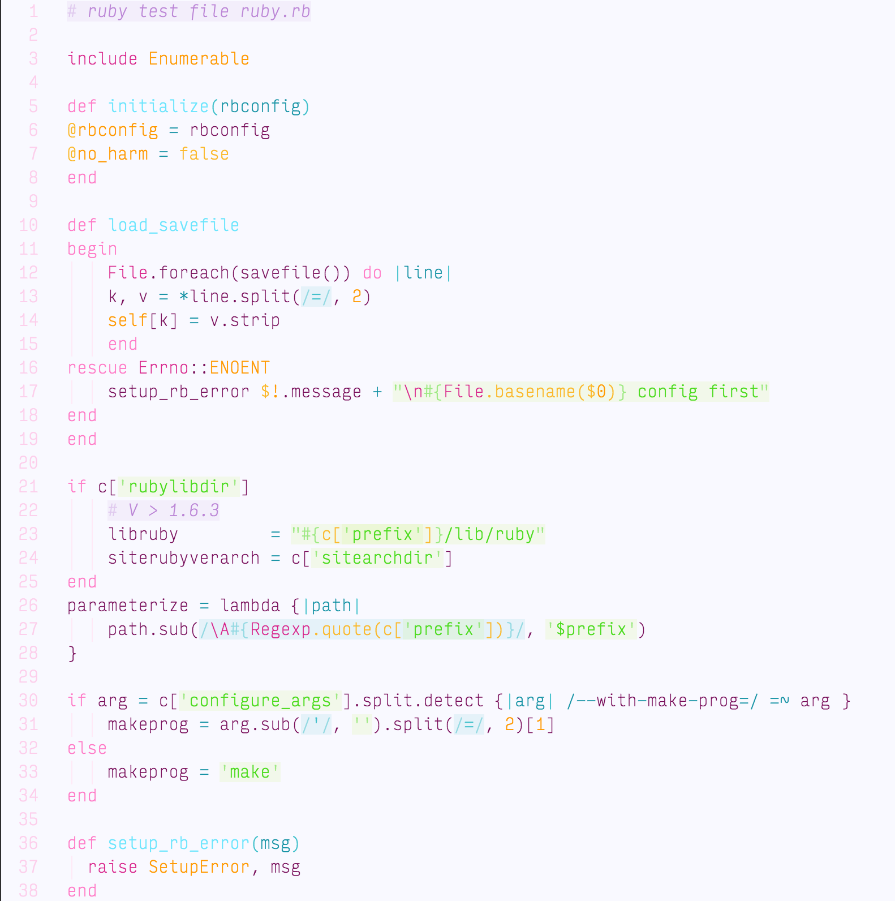

# Princess Syntax Theme

A bright syntax theme, with plenty of pink and purple. It's mostly optimized for Ruby, with occasional JavaScript, CSS, and markup. More improvements will probably be coming, but it's also possible I'll get bored and move on. Use at your own risk.

